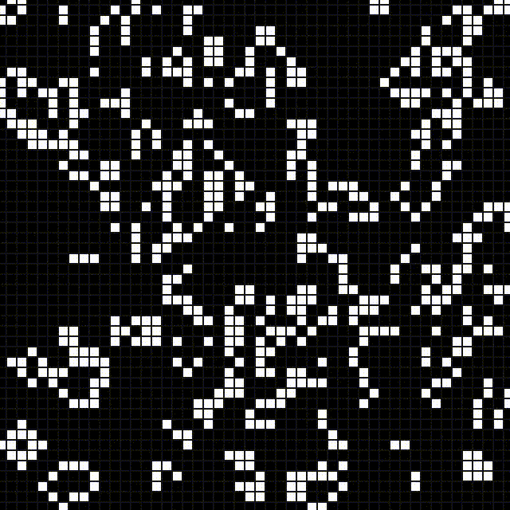
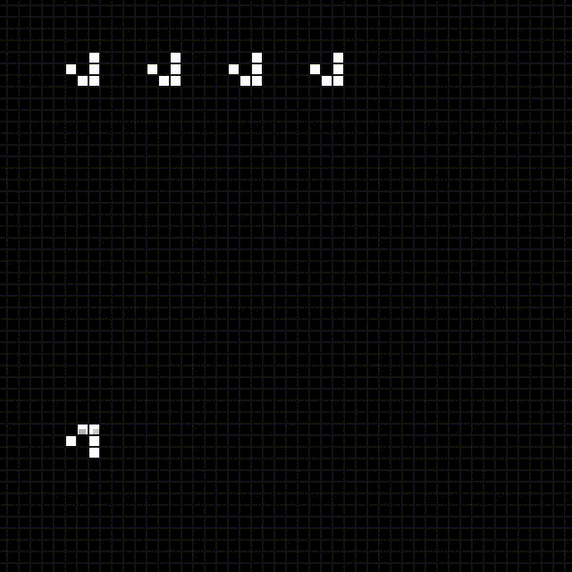
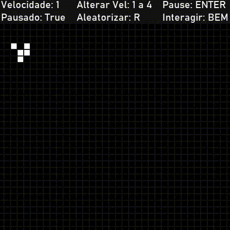
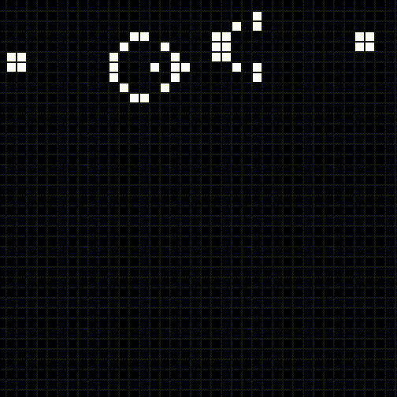

# Game of Life

<!-- TABELA DE CONTEUDO -->

  
Conteúdos

  <ol>
    <li>
      <a href="#sobre o projeto">Sobre o projeto</a>
      <ul>
        <li><a href="#criado com">Criado com</a></li>
      </ul>
    </li>
    <li>
      <a href="#instalacao">Instalação</a>
    </li>
  </ol>

Implementação do Game of Life de Comway em Python, utilizando o pacote PyGame

